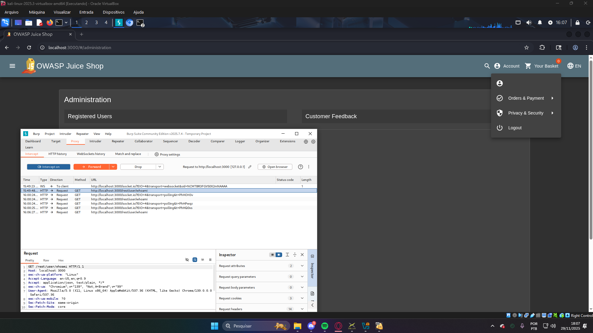

# Web Hacking: SQL Injection no OWASP Juice Shop 🕷️

Exploração prática de injeção SQL para bypass de autenticação e escalonamento de privilégios utilizando o Burp Suite.

## Stack Técnica
* **Laboratório:** OWASP Juice Shop (Vulnerável por design)
* **Ferramenta:** Burp Suite Community Edition
* **Vulnerabilidade:** Falha de sanitização em parâmetros JSON no endpoint de login.

## Execução do Ataque
O processo consistiu na interceptação e manipulação do tráfego HTTP para forçar uma autenticação administrativa.

1. **Identificação:** Capturei a requisição de login via Proxy para analisar a estrutura do payload JSON.
2. **Injeção de Payload:** No campo de e-mail, inseri o comando `' OR 1=1 --` para quebrar a lógica da query original.
3. **Exploração:** Ao anular o restante da query com o comentário (`--`) e validar a condição como verdadeira (`1=1`), o backend retornou o primeiro usuário da base de dados (Admin).

### Prova de Conceito (PoC)
Abaixo, a evidência do login administrativo realizado com sucesso:

## Notas de Segurança (AppSec)
A exploração reforça que a validação de dados deve ser obrigatória no **backend**. Para mitigar este tipo de falha, é indispensável o uso de **Prepared Statements** (Queries Parametrizadas), impedindo que o input do usuário seja interpretado como comando pelo banco de dados.

---
*Laboratório focado em OWASP Top 10 e Segurança de Aplicações.*
